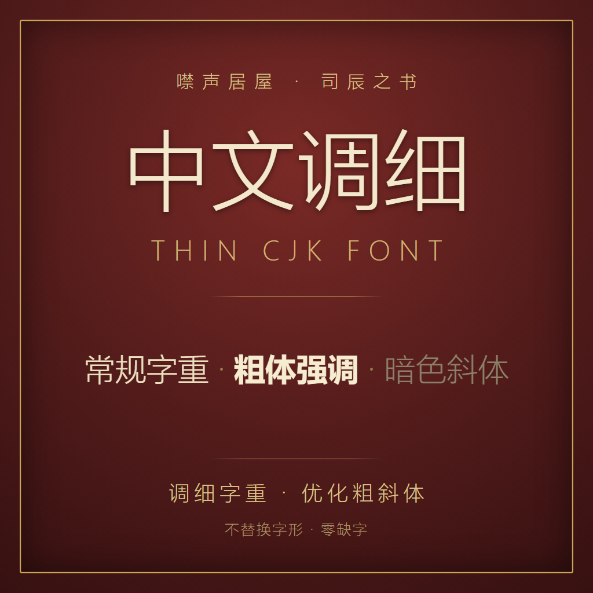

# ThinCJKFont — Book of Hours 中文字体微调



把《司辰之书》(Book of Hours) 内置的简体中文字体调细:正文变细、粗体不再臃肿、斜体改为暗色且不倾斜。**不替换字形、不引入外部字体、不改字号** —— 字符覆盖与原版完全一致,零缺字。

所有参数都能在 mod 目录的 `config.json` 里自定义,**保存即时生效,无需重启游戏**。

## 它做了什么

这是一个运行时(DLL)mod,只调整游戏内置 CJK 字体 (NotoSansCJKsc / 思源黑体) 的渲染方式:

- **字重** —— 通过 TextMeshPro 材质的 `_WeightNormal` / `_WeightBold` / `_FaceDilate` 把字调细或加粗。
- **斜体** —— 取消斜体倾斜 (`italicStyle = 0`),并可把斜体文字改成自定义暗色。
- **字形缩放** —— 在 `OnTextChanged` 里对 CJK 字形做顶点级横/纵比例缩放(可选,默认不动)。
- **进阶项** —— 字距、合成字重、描边宽度/柔化/颜色等,按需在 `config.json` 添加对应键即可。

参数语义:`config.json` 里写了某个键就按字面值生效;不写(或删掉)该键则保持游戏原值。把 `enabled` 改成 `false` 即整体恢复原版。

## 安装(订阅创意工坊)

1. 在 Steam 创意工坊订阅本 mod。
2. **同时订阅并启用 [Ghirbi, the Gatekeeper(守门人吉尔比)]** —— 游戏默认不加载代码型 mod,需要这个"守门人"放行。
3. 重启游戏。在「设置 → 第六史 / MODS」里确认两个 mod 都已启用。

> ⚠ 本 mod 含第三方代码 (DLL)。这是 Book of Hours 引擎的安全机制,务必先装 Ghirbi 才会生效。

## 配置

mod 目录(游戏内「设置 → 浏览文件」可定位)下的 `config.json`:

```json
{
  "configVersion": 2,
  "enabled": true,

  "normalWeight": 0.25,
  "boldWeight": 0.85,
  "thickness": 0,

  "isDisableItalic": true,
  "italicColor": "#FFE300"
}
```

完整键说明见同目录的 `config.help.html`(由 DLL 在每次启动时按当前版本自动生成)。编辑保存后约 0.5 秒内热重载,游戏内立即可见。

mod 更新时,已存在的 `config.json` 会按 `configVersion` 做增量迁移:保留你的设置,只补齐新字段、清理废弃哨兵。

## 从源码构建

需要本机安装有 Book of Hours,并按实际路径修改 `src/ThinCJKFont.csproj` 里的 `<GameManaged>`(指向 `Book of Hours\bh_Data\Managed`)。

```sh
cd src
dotnet build -c Release
```

产物 `bin/Release/ThinCJKFont.dll` 复制到 mod 目录的 `dll/` 下即可。目标框架 net472,引用游戏自带的 Unity / TextMeshPro / SecretHistories 程序集。

## 目录结构

```
mod/            即装即用的 mod 文件夹(创意工坊上传的就是它)
  synopsis.json       mod 元数据(名称/作者/版本/简介)
  config.json         默认配置
  config.help.html    配置项说明(DLL 自动生成)
  cover.png           创意工坊封面
  dll/ThinCJKFont.dll 编译产物
src/            C# 源码与工程文件
assets/         README 用的封面大图
```

## 致谢与许可

作者 XHXIAIEIN。基于 Weather Factory 的 Book of Hours / SecretHistories 引擎 modding 接口。仅调整渲染,不分发任何字体文件。
